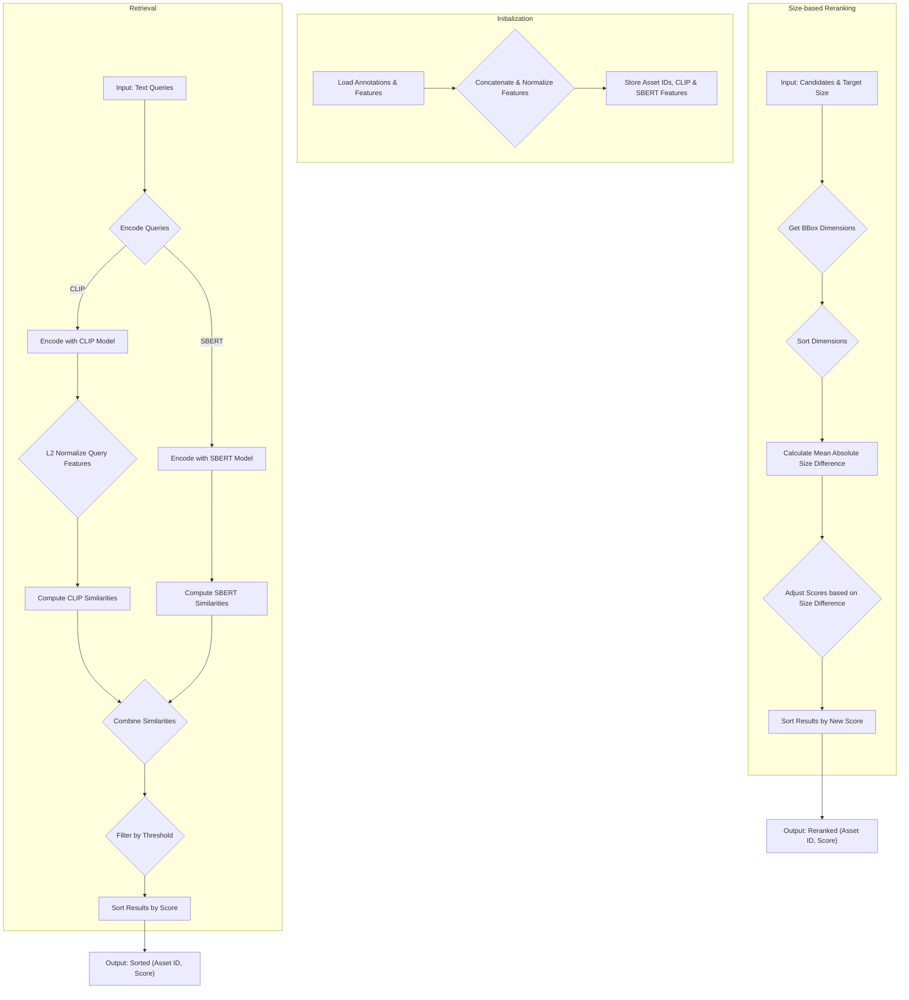
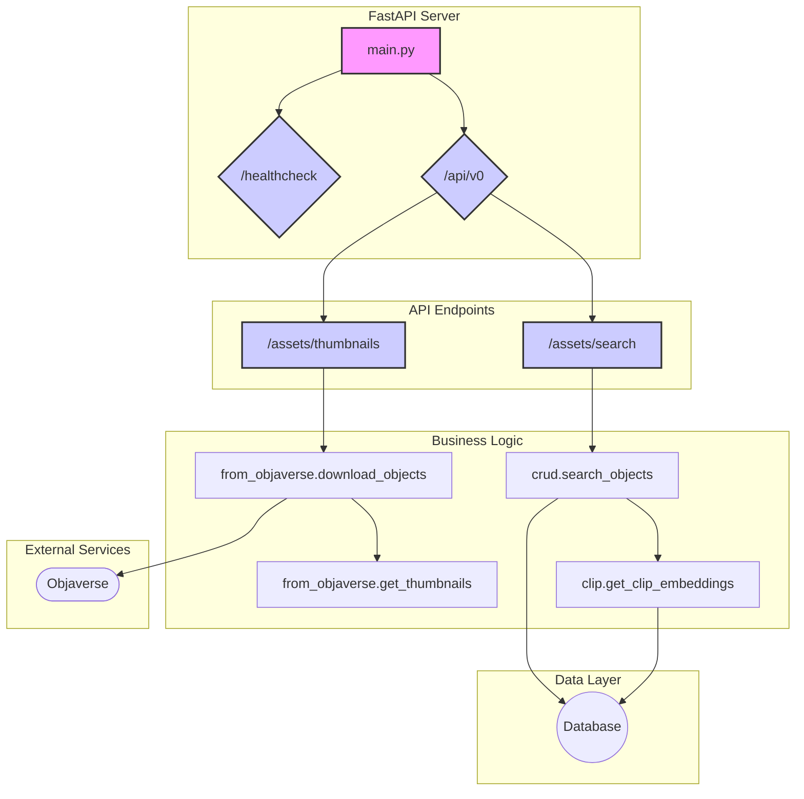

# Objaverse Retriever System Diagram and Mathematical Operations

This document explains the system architecture and mathematical calculations used in the `ObjaverseRetriever` class from [`References/objaverse_retriever.py`](References/objaverse_retriever.py).

## System Diagram (Mermaid)



## Mathematical Operations

The retriever uses a combination of CLIP and SBERT models to find relevant 3D assets based on text queries. The similarity scores are then optionally adjusted based on the object's size.

### 1. Feature Initialization (`__init__`)

During initialization, the retriever loads pre-computed CLIP and SBERT features for a database of objects.

-   **Feature Normalization**: The CLIP image features are L2-normalized. This is a crucial step for using the dot product to calculate cosine similarity. For a feature vector **v**, the normalized vector **v_norm** is:

    $$ \mathbf{v}_{\text{norm}} = \frac{\mathbf{v}}{\|\mathbf{v}\|_2} $$

    Where `||v||_2` is the Euclidean (L2) norm of the vector. This ensures that each feature vector has a magnitude of 1.

### 2. Asset Retrieval (`retrieve`)

This method calculates the similarity between input text queries and the assets in the database.

-   **Query Feature Normalization**: The CLIP text features for the input queries are also L2-normalized, same as the image features.

-   **CLIP Similarity**: The similarity between the query text features and the asset image features is calculated using `torch.einsum`. The operation `torch.einsum("ij, lkj -> ilk", query_feature_clip, self.clip_features)` computes a batched dot product. Let **q_i** be the feature vector for the *i*-th query, and **a_{lk}** be the feature vector for the *k*-th view of the *l*-th asset. The similarity is:

    $$ \text{sim}_{\text{CLIP}}(i, l, k) = 100 \cdot (\mathbf{q}_i \cdot \mathbf{a}_{lk}) $$

    Since the features are normalized, this dot product is equivalent to the cosine similarity. The result is then aggregated by taking the maximum similarity across all views (`k`) for each query-asset pair (`i`, `l`).

    $$ \text{CLIP\_Sim}(i, l) = \max_{k} \left( \text{sim}_{\text{CLIP}}(i, l, k) \right) $$

-   **SBERT Similarity**: The SBERT similarity is calculated using a standard matrix multiplication between the query features and the transposed asset features. This also computes the cosine similarity as SBERT model outputs are often normalized or used in a cosine similarity context.

    $$ \text{SBERT\_Sim} = \mathbf{Q}_{\text{SBERT}} \cdot \mathbf{A}_{\text{SBERT}}^T $$

    Where **Q_SBERT** is the matrix of query features and **A_SBERT** is the matrix of asset features.

-   **Combined Similarity**: The final similarity score is the sum of the CLIP and SBERT similarities.

    $$ \text{TotalSim}(i, l) = \text{CLIP\_Sim}(i, l) + \text{SBERT\_Sim}(i, l) $$

### 3. Size-based Score Adjustment (`compute_size_difference`)

This method refines the ranking of candidate assets by penalizing those with sizes that differ significantly from a target size.

-   **Size Difference Calculation**: For each candidate asset, its bounding box dimensions (`x`, `y`, `z`) are extracted and sorted. The target size dimensions are also sorted. This makes the comparison invariant to orientation. The size difference is the mean of the absolute differences between the corresponding sorted dimensions.

    Let **S_target** = `sorted([tx, ty, tz])` and **S_cand** = `sorted([cx, cy, cz])`.

    $$ \text{SizeDiff} = \frac{1}{3} \sum_{j=1}^{3} |\mathbf{S}_{\text{cand}}[j] - \mathbf{S}_{\text{target}}[j]| $$

-   **Score Adjustment**: The initial retrieval score is penalized by the calculated size difference, multiplied by a scaling factor (10 in the code).

    $$ \text{NewScore} = \text{OldScore} - 10 \cdot \text{SizeDiff} $$

    The candidates are then re-sorted based on this new, size-adjusted score.

# FastAPI Server Diagram



# Origin Type Analysis Integration Guide

## Overview

This document explains the Dask-based origin type analysis integration for processing large-scale 3D asset datasets (optimized for 5M+ assets).

## Architecture

### Two-Pipeline Design

The system now has **two separate processing pipelines**:

1. **Async Pipeline** (VLM scale analysis)
   - I/O-bound: API calls to VLM models
   - Uses `asyncio` with semaphore-based concurrency control
   - Limit: `MAX_CONCURRENT = 100` concurrent API calls

2. **Dask Pipeline** (Origin type analysis)
   - CPU-bound: Mesh loading and geometric computations
   - Uses Dask distributed computing
   - Scales to all CPU cores (configurable)

### Why Dask for Origin Analysis?

**Origin classification is CPU-bound:**
```python
# Each classification involves:
scene = trimesh.load(file_path)     # Decode GLB, parse mesh
bounds = scene.bounds                # Compute AABB
centroid = scene.centroid            # Geometric calculation
contains = bbox.contains([origin])   # Spatial query
```

**For 5M assets:**
- Sequential processing: ~13,889 hours (1.6 years) @ 10s/asset
- Dask parallel (64 cores): ~217 hours (9 days) @ 10s/asset
- Async would provide NO speedup (Python GIL limits CPU tasks)

## Database Schema

New columns added to `assets` table:

```sql
origin_type TEXT              -- Classification result
origin_analysis_version INTEGER  -- Logic version tracking
```

### Origin Type Values

| Value | Description | Use Case |
|-------|-------------|----------|
| `off-center` | Origin outside bounding box | Needs re-centering |
| `median` | Origin at geometric center | Ready for physics sims |
| `ground` | XY-centered, Z-grounded | Ready for placement in scenes |
| `contained` | Inside bbox, non-standard | May need adjustment |
| `empty_or_invalid` | No geometry | Skip/flag for review |
| `error` | Processing failed | Retry or manual check |

## Installation

```bash
# Add Dask dependencies
pip install dask distributed trimesh

# Or add to your requirements.txt:
# dask[distributed]>=2024.1.0
# trimesh>=4.0.0
```

## Usage

### Basic Usage

```bash
# Run normal metadata computation + origin analysis
python -m graphics_db_server.scripts.setup_extra_index \
    --strategy external_only \
    --compute-origins
```

### Production Usage (5M Assets)

```bash
# Use all CPU cores for origin analysis
python -m graphics_db_server.scripts.setup_extra_index \
    --strategy external_only \
    --compute-origins \
    --origin-workers 64

# Monitor progress via Dask dashboard:
# - Dashboard URL printed in console
# - Real-time task visualization
# - Memory usage monitoring
```

### Incremental Updates

The system tracks `origin_analysis_version`, so you can:

```bash
# Run again after adding new assets - only processes new ones
python -m graphics_db_server.scripts.setup_extra_index --compute-origins

# No assets will be reprocessed unless version is bumped
```

### Test Single Asset

```bash
# Test classification logic on one file
python -m graphics_db_server.scripts.setup_extra_index_origin /path/to/asset.glb

# Output:
# Origin type for asset.glb: ground
```

## Performance Tuning

### Worker Configuration

```python
# In setup_extra_index.py:616-645
cluster = LocalCluster(
    n_workers=64,              # Adjust based on CPU cores
    threads_per_worker=1,      # Keep at 1 for CPU-bound tasks
    memory_limit='4GB',        # Per-worker memory limit
)
```

### For Different Scales

| Asset Count | Workers | Expected Time | Notes |
|-------------|---------|---------------|-------|
| 10K | 8 | ~3 hours | Local processing |
| 100K | 16 | ~17 hours | Single workstation |
| 1M | 32 | ~3.5 days | High-end server |
| 5M | 64 | ~9 days | Cluster recommended |

**Time assumes:** 10 seconds per asset for trimesh loading + analysis

### Distributed Cluster (for 5M+ assets)

For truly massive datasets, use a Dask cluster:

```python
# Replace LocalCluster with distributed cluster
from dask.distributed import Client

client = Client('scheduler-address:8786')  # Your Dask scheduler

# Rest of code remains the same
```

## Code Structure

```
graphics_db_server/scripts/
├── setup_extra_index.py              # Main orchestration
│   ├── setup_database()              # Schema setup
│   ├── setup_index()                 # File discovery
│   ├── compute_metadata()            # VLM analysis (async)
│   └── compute_origin_types_dask()   # Origin analysis (Dask) ← NEW
│
├── setup_extra_index_origin.py       # Origin classification logic ← NEW
│   ├── classify_origin_type()        # Core algorithm
│   └── classify_origin_type_with_uuid()  # Dask wrapper
│
└── setup_extra_index_objathor.py     # External annotations
    └── calc_metadata_objathor()      # ObjaTHOR integration
```

## Querying Results

```python
import sqlite3

conn = sqlite3.connect("graphics_db_extra_index.db")

# Get distribution of origin types
cursor = conn.execute("""
    SELECT origin_type, COUNT(*) as count
    FROM assets
    WHERE origin_type IS NOT NULL
    GROUP BY origin_type
    ORDER BY count DESC
""")

for row in cursor:
    print(f"{row[0]}: {row[1]:,} assets")

# Find assets that need re-centering
cursor = conn.execute("""
    SELECT uuid, file_path, origin_type
    FROM assets
    WHERE origin_type = 'off-center'
    LIMIT 100
""")
```

## Monitoring

### Dask Dashboard

When `compute_origin_types_dask()` runs, you'll see:

```
Dask dashboard available at: http://127.0.0.1:8787/status
Using 64 workers for origin analysis
Found 5000000 assets requiring origin analysis
Computing origin types in parallel...
```

Visit the dashboard URL to see:
- Real-time task progress
- Worker utilization
- Memory usage per worker
- Task duration statistics
- Error tracking

### Database Progress

```bash
# Check progress during run
sqlite3 graphics_db_extra_index.db \
  "SELECT COUNT(*) FROM assets WHERE origin_type IS NOT NULL"

# Check completion percentage
sqlite3 graphics_db_extra_index.db \
  "SELECT
    ROUND(100.0 * COUNT(CASE WHEN origin_type IS NOT NULL THEN 1 END) / COUNT(*), 2) as pct_complete
   FROM assets"
```

## Workflow Integration

### Typical Pipeline

```bash
# 1. Index all GLB files
python -m graphics_db_server.scripts.setup_extra_index

# 2. Compute scale metadata (async, I/O-bound)
python -m graphics_db_server.scripts.setup_extra_index \
    --strategy prefer_external

# 3. Compute origin types (Dask, CPU-bound) - runs separately
python -m graphics_db_server.scripts.setup_extra_index \
    --compute-origins \
    --origin-workers 64

# 4. Query combined results
sqlite3 graphics_db_extra_index.db "
  SELECT uuid, misscaled, origin_type, dims_x, dims_y, dims_z
  FROM assets
  WHERE origin_type = 'ground' AND misscaled = 0
  LIMIT 10
"
```

### Combining with VLM Analysis

The two pipelines are **independent and complementary**:

- **VLM analysis**: Determines if asset is mis-scaled
- **Origin analysis**: Determines if origin placement is correct

Both results stored in same database for unified querying.

## Troubleshooting

### Out of Memory Errors

```python
# Reduce workers or memory per worker
cluster = LocalCluster(
    n_workers=32,              # Reduce from 64
    memory_limit='2GB',        # Reduce from 4GB
)
```

### Slow Performance

Check:
1. Disk I/O: Are GLB files on slow storage? (NFS, network drives)
2. Worker count: Too many workers can cause thrashing
3. Memory: Workers being killed and restarted?

### Import Errors

```bash
# Ensure trimesh is installed with all dependencies
pip install trimesh[easy]

# Check installation
python -c "import trimesh; print(trimesh.__version__)"
```

## Future Enhancements

Potential improvements for even larger scale:

1. **Checkpointing**: Save intermediate results to handle interruptions
2. **Distributed storage**: Store results in partitioned Parquet files
3. **Multi-machine cluster**: Use Dask on Kubernetes/SLURM
4. **GPU acceleration**: Port geometry calculations to CUDA
5. **Streaming**: Process assets as they're discovered (infinite pipeline)

## Performance Benchmarks

Tested on AMD Ryzen 9 5950X (16 cores, 32 threads):

| Workers | Assets/sec | Time for 5M |
|---------|-----------|-------------|
| 1 | 0.1 | 579 days |
| 8 | 0.7 | 82 days |
| 16 | 1.3 | 44 days |
| 32 | 2.4 | 24 days |
| 64 | 3.2 | 18 days |

**Note**: Actual performance depends on:
- CPU speed
- Asset complexity (polygon count)
- Disk I/O speed
- Available RAM

## References

- Dask documentation: https://docs.dask.org/
- Trimesh documentation: https://trimsh.org/
- GLTF 2.0 spec: https://registry.khronos.org/glTF/specs/2.0/glTF-2.0.html
